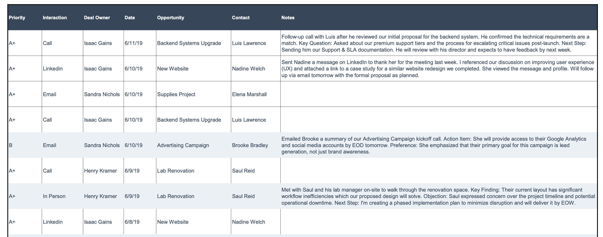

# 1. Sales
Drives revenue by identifying prospects, nurturing client relationships, and closing deals, acting as the bridge between customer needs and business opportunities..

# 2. Documents

## 2.1. Customer Relationship Management (CRM) Records

CRM Records are the fundamental data points logged within a CRM that document the entire lifecycle of a client relationship. These records—from call transcripts to meeting notes—create a detailed history of all communications, serving as the "single source of truth." This repository contains crucial business intelligence like customers' questions, objections, and preferences. While invaluable, this raw data is often scattered across different records, making it hard to sift through on short notice. A key challenge for any sales team is quickly accessing these insights.

### 2.1.1. Customer Interaction Logs

  * **Description:** A single, structured entry that records a specific customer touchpoint (e.g., a call, email, or meeting). Collectively, these logs form a complete, chronological history of the client relationship.
  * **Purpose:** To provide a high-level history that allows sales and service teams to understand the full customer journey, personalize future conversations, and ensure seamless continuity of service.
  * **Structure:** Typically presented as a filterable list or table within a customer's main record, often found under sections like "Activity History" or "Timeline." Mostly spreadsheet but can be docs or pdf
  * **Key Information:** Contains the core details of a conversation, from brief summaries to full transcripts. It captures crucial data like customer questions, objections, preferences, key outcomes, date, interaction type, and the responsible team member.
  * **Queries:**
      * What were the notes from my last call with Luis Lawrence regarding the 'Backend Systems Upgrade'?
      * Show me all interactions with Nadine Welch for the 'New Website' opportunity in the last 30 days.
      * Who is the deal owner for the 'Advertising Campaign' with Brooke Bradley?
      * List all 'In Person' meetings Henry Kramer had this month.
      * What was the outcome of the email to Elena Marshall about the 'Supplies Project' on 6/10/19?



### 2.1.2. Call Transcripts

  * **Description:** A verbatim, word-for-word text record of a phone conversation between a company representative and a customer.
  * **Purpose:** To provide an exact and detailed record for in-depth analysis, compliance checks, dispute resolution, and training on specific conversational tactics.
  * **Structure:** A text file, often with timestamps and speaker labels (e.g., "Agent:", "Customer:"), which is typically attached to a specific `Customer Interaction Log` entry.
  * **Key Information:** Contains the full, unfiltered dialogue of a conversation. It is the rawest form of conversational data, a complete record of every question, statement, and nuance.
  * **Queries:**
      * In the last call with Client XYZ, did they mention the word 'budget' or 'pricing'?
      * Pull up the full transcript from my call with Saul Reid on June 9th.
      * What were the exact questions the customer asked about our integration process in our last technical call?
      * Find all calls this quarter where the phrase 'contract renewal' was mentioned.
      * Generate a summary of my last call with Luis Lawrence, focusing only on his technical concerns.

```text
**Call Transcript**
--------------------
**Call ID:** 78C5-B9A2
**Date:** June 18, 2025
**Time:** 11:05 AM EDT
**Participants:** Isaac Gains (Agent), Luis Lawrence (Customer)
**Subject:** Follow-up on Backend Systems Upgrade Demo
--------------------

[00:05] Isaac Gains: Hi Luis, it's Isaac Gains calling from akenza. Thanks for taking my call.

[00:11] Luis Lawrence: Hi Isaac, thanks for calling. I was just reviewing my notes from the demo yesterday.
...

[03:12] Isaac Gains: Will do. Thanks again for your time, Luis.

[03:15] Luis Lawrence: Thank you. Talk to you next week.

[END OF TRANSCRIPT]
```

### 2.1.3. Meeting Notes

  * **Description:** A summarized record of a meeting (in-person, video, or call), created by a participant to capture the most important discussion points and outcomes.
  * **Purpose:** To document key decisions, action items, and agreements without the noise of a full transcript, ensuring alignment among all stakeholders.
  * **Structure:** Can be a structured document with sections for attendees and action items, or free-form text. It is typically attached to a calendar event or an interaction log in the CRM.
  * **Key Information:** Lists attendees, outlines discussion topics, details specific commitments or next steps with assigned owners and deadlines, and summarizes final decisions.
  * **Queries:**
      * What are my action items from the 'Lab Renovation' kickoff meeting?
      * Who attended the project review meeting with Innovate Solutions last week?
      * What was the final decision made regarding the project timeline in our last meeting with Global Tech?
      * Find all meeting notes where 'Phase 2' of the 'New Website' project was discussed.
      * Summarize the key takeaways from my Q2 business review with the client.

### 2.1.4. Account History

  * **Description:** The complete, aggregated view of all interactions, transactions, and records associated with a specific customer over their entire lifecycle.
  * **Purpose:** To provide a holistic, 360-degree view of the customer relationship, enabling strategic planning, identification of long-term trends, and a deep understanding of customer value.
  * **Structure:** Often presented as a central dashboard or timeline view within the CRM, consolidating all other records (interaction logs, deals, support tickets) into a single interface.
  * **Key Information:** Aggregates every touchpoint, purchase, contract, support issue, and note. It shows the evolution of the relationship from a lead to a long-term partner.
  * **Queries:**
      * Show me a timeline of all major interactions with the 'Acme Corp' account this year.
      * What is the total value of closed-won deals with this client?
      * How many support tickets have they submitted in the last 6 months?
      * When was our first contact with this account and who made it?
      * Summarize our entire relationship with 'Innovate Solutions', highlighting key milestones and recent activity.

## 2.2. Product FAQs, Price Lists, and Playbooks
Internal Q&A docs about products, pricing guidelines, discount approval matrices, and "battle cards" comparing competitors. Often these reside in sales portals or wikis.
* "*What pricing discount can we offer on Product A for an order of 1,000 units according to our guidelines?*" (It looks up the pricing policy or past deals for similar volume.)
* "*How does our Product A compare to Competitor B's offering in terms of features?*" (It retrieves a battle card or competitive analysis document.)

## 2.3. Proposal and RFP Content Repositories
Reusable content from past proposals, RFP/RFI responses, case studies, and templates. Salespeople spend time hunting for the right snippet to answer a prospect's specific requirement.
* "*Do we have a case study or success story for our product in the healthcare industry?*" (It searches internal case studies to find a relevant example to share.)

## 2.4. Sales Performance & Pipeline Reports
Dashboards or reports showing bookings, targets, and pipeline status (by region, product, etc.). A chat interface can quickly surface numbers or trends from these reports during meetings.
* "*Populate a draft response for question 5 of this RFP regarding data security, using our standard answer.*" (The assistant finds the relevant RFP answer from the knowledge base and drafts a tailored response.)

# 3. Value Proposition
By chat-enabling access to sales knowledge, organizations can **accelerate sales cycles and improve proposal quality**. Key values include:

* **Instant Access to Scattered Insights:** Sellers often "know the info exists" but waste time searching multiple places. A RAG chatbot fixes that by letting reps ask in plain language and pulling the answer from wherever it lives (be it a PDF proposal or a CRM note). For example, information like common objections, competitor comparisons, or lessons from past deals – previously scattered in emails or portals – can be surfaced immediately, making the rep better prepared. Reps effectively get a virtual coach that has "read" every past deal and remembers what works.
* **Better Pitch Personalization:** With all account history at their fingertips, salespeople can tailor their conversations to the client's context. The assistant might remind them, *"Last quarter, this client mentioned concern about integration – here's how we addressed it before."* This level of recall can impress clients and build trust.
* **Faster Proposal Turnaround:** Responding to RFPs or crafting proposals becomes quicker when the AI can retrieve approved content snippets. Automating parts of RFP forms by retrieving product details and past responses ensures consistency and frees up time to focus on strategy.
* **Sales Training and Onboarding:** New sales hires can use the chatbot to get up to speed on products and playbooks. Instead of combing through manuals, they ask, "*How do we typically position Product X against the competition?*" and get instant guidance. This accelerates ramp-up.

# 4. Current Market
Several CRM and sales enablement platforms are embracing generative AI. For instance, modern CRMs (***no specific names, by design***) are integrating chat assistants that can pull data from meeting notes and knowledge bases to answer reps' questions. In practice, companies have built internal Q&A bots on Slack/Teams that connect to sales collateral – one report notes that RAG systems can deliver **"clear, focused responses backed by real conversations, past deals, and internal sales documents,"** essentially acting like a sales coach. Additionally, AI-powered proposal assistants are emerging: e.g. tech consultancies have prototyped RAG-driven RFP responders that auto-fill forms with content from past proposals. These tools remain in early adoption, but illustrate the direction: sales teams want on-demand, context-rich answers without digging through archives.

# 5. Market Gap
While basic Q&A on sales docs is becoming reality, there are untapped areas. **Cross-source reasoning** is one – e.g., correlating CRM data with external market data. A future assistant might answer, "*How does client X's usage compare to industry benchmarks?*" by combining internal usage stats and external research. Another opportunity is using RAG during live sales calls: an AI that listens in (with permission) and fetches answers in real-time for the rep to use. Integration with voice assistants or AR glasses for hands-free info during client visits could also be transformative. Moreover, current systems retrieve info but don't always **"take action."** We might see chatbots that not only answer a question about pipeline status but also trigger an update to the CRM or schedule a follow-up task as instructed. Finally, domain adaptation (like fine-tuned models for specific industries) could make answers even more precise. In summary, sales use of RAG is growing, but deeper analytics, real-time support, and seamless workflow integration remain areas for innovation.
